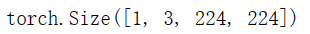
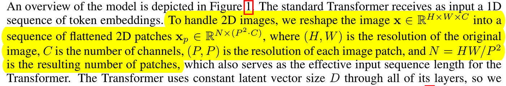
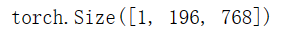
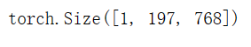
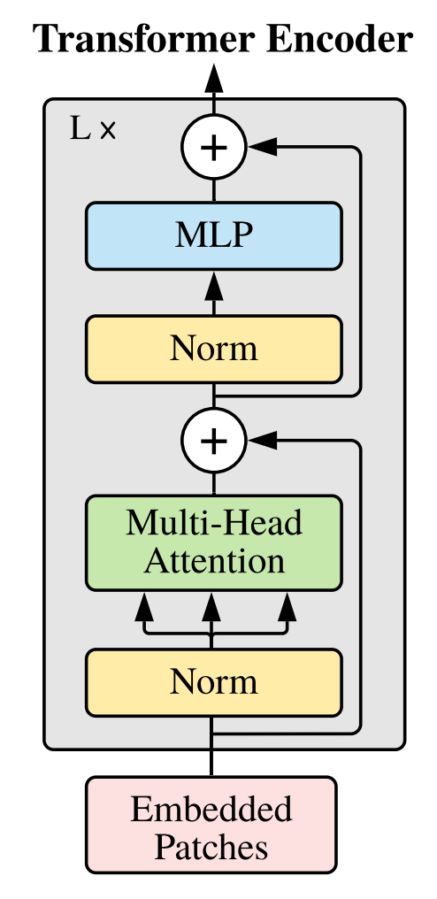
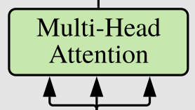
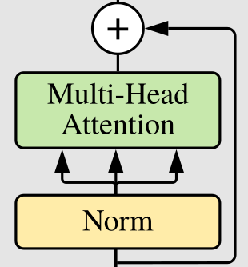
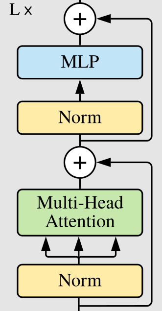
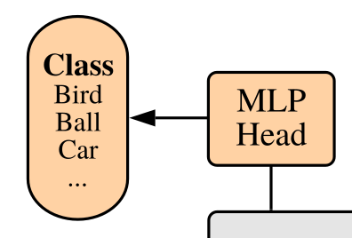
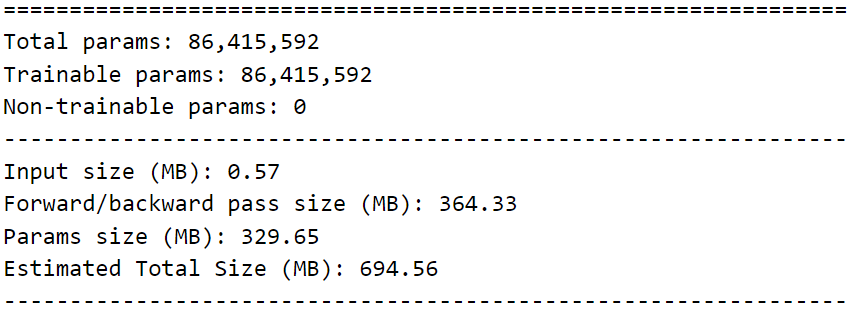

# 使用PyTorch构建Vision Transformer（ViT）

写在前面，如今视觉Transformer研究如火如荼，ViT也是该领域的开山之作，为了更加深入理解ViT我认为敲一遍代码——用PyTorch实现它，可以更好的帮助我们理解ViT。

- 我们的代码来源这篇文章：https://towardsdatascience.com/implementing-visualttransformer-in-pytorch-184f9f16f632（需要科学上网）
- ViT的论文在这里：https://arxiv.org/abs/2010.11929
- 也许你需要详细的论文解读：https://www.bilibili.com/video/BV15P4y137jb/?share_source=copy_web

- 这份代码中我们会使用到这个库：[Einops](#https://github.com/arogozhnikov/einops/)
  - 这个库使得我们可以通过简单代码来完成对张量的操作。
  - 相关文档在这里：https://einops.rocks/
  - 有个值得一读的论文（ICLR 2022 Oral）：https://openreview.net/pdf?id=oapKSVM2bcj
- 再次强调，本文中的代码是基于PyTorch的，并没有使用到其他额外的东西，我尽可能提供多的有关于代码的解释（相较于原文作者）。
- 有关于代码的实现是多种多样的，本文中的代码并能代表权威，如果您有不认可或存疑的地方，我建议您可以去PyTorch的视觉模型库中查看PyTorch官方对ViT的实现。[点击这里](#https://github.com/pytorch/vision/tree/main/torchvision/models)


上图是ViT的模型结构，下图是Transformer Encoder的结构。


结合论文不难看出，我们的模型需要以下结构：

- Patches Embeddings
  - Linear Projection
  - CLS Token
  - Position Embedding
- Transformer Encoder
  - Norm
  - Multi-Head Attention
  - Residuals
  - MLP
- MLP head

下面是我们整个模型需要包含的库：

```python
import torch
import torch.nn.functional as F
import matplotlib.pyplot as plt

from torch import nn
from torch import tensor
from PIL import Image
from torchvision.transforms import Compose, Resize, ToTensor
from einops import rearrange, reduce, repeat
from einops.layers.torch import Rearrange, Reduce
from torchsummary import summary
```

这里您可能会有些疑问什么是einops，应该如何使用它，下面我将为您介绍，注意本文中einops代码只涉及到了部分，如果您想要详细学习可以访问以下网址：

- https://einops.rocks/

我们不需要使用到其他额外的Python库，只需要PyTorch和一些基础的东西。让我们开始，请先准备好一张图片：

```python
img = Image.open('./luo.jpg')
fig = plt.figure()
plt.imshow(img)
```


接下来，我们需要将图片转换成我们需要的大小：

```python
# 调整图像大小为224*224
transform = Compose([Resize((224, 224)), ToTensor()])
x = transform(img)

# 为图像增加batch_size维度
x = x.unsqueeze(0)
x.shape
```



我们需要将图像转化为多个图像块并将其展平。


具体操作可见下图，引自论文。



很容易利用einops实现，下面给出示例：

```python
patch_size = 16
pathcs = rearrange(x, 'b c (h s1) (w s2) -> b (h w) (s1 s2 c)', s1=patch_size, s2=patch_size)
```

现在，我们需要将这些图像“喂入”一个普通的线性层。我们可以创建PatchEmbedding类来保持我们的代码漂亮和整洁。

```python
class PatchEmbedding(nn.Module):
    def __init__(self, in_channels: int = 3, patch_size: int = 16, emb_size: int = 768):
        self.patch_size = patch_size
        super().__init__()
        self.projection = nn.Sequential(
            Rearrange('b c (h s1) (w s2) -> b (h w) (s1 s2 c)', s1=patch_size, s2=patch_size),
            nn.Linear(patch_size * patch_size * in_channels, emb_size)
        )
    def forward(self, x: Tensor) -> Tensor:
        x = self.projection(x)
        return x
 
PatchEmbedding()(x).shape
```



注意，在检查了官方的原始实现后，我发现作者为了提高性能，使用了Conv2d层而非Linear层。这是通过使用与“patch_size”相等的kernel_size和stride获得的。直观的说，卷积操作是单独应用于每个图像块。因此，我们需要首先使用卷积层，然后再展平所有的图像块。

```python
class PatchEmbedding(nn.Module):
    def __init__(self, in_channels: int = 3, patch_size: int = 16, emb_size: int = 768):
        self.patch_size = patch_size
        super().__init__()
        self.projection = nn.Sequential(
            # using a conv layer instead of a linear one -> performance gains
            nn.Conv2d(in_channels, emb_size, kernel_size=patch_size, stride=patch_size),
            Rearrange('b e h w -> b (h w) e')
        )
                
    def forward(self, x: Tensor) -> Tensor:
        x = self.projection(x)
        return x
    
PatchEmbedding()(x).shape
```


## CLS Token

下一步是添加cls token和位置编码。cls token只是数字，放在每个序列的0号位置。

```python
class PatchEmbedding(nn.Module):
    def __init__(self, in_channels: int = 3, patch_size: int = 16, emb_size: int = 768):
        self.patch_size = patch_size
        super().__init__()
        self.projection = nn.Sequential(
            # using a conv layer instead of a linear one -> performance gains
            nn.Conv2d(in_channels, emb_size, kernel_size=patch_size, stride=patch_size),
            Rearrange('b e h w -> b (h w) e')
        )
        
        self.cls_token = nn.Parameter(torch.randn(1, 1, emb_size))
                
    def forward(self, x: Tensor) -> Tensor:
        b, _, _, _ = x.shape
        x = self.projection(x)
        cls_tokens = repeat(self.cls_token, '() n e -> b n e', b=b)
        
        x = torch.cat([cls_tokens, x], dim=1)
        return x
    
PatchEmbedding()(x).shape
```



`cls_token` 通过 `torch.Parameter` 随机生成，在 `forward` 函数中，它将被重复拷贝 `b` (batch)次并使用 `torch.cat` 将其假如到图像序列中。

## 位置编码

到目前为止，该模型尚不知图像块的原始位置。因此我们需要传递这一空间信息。这可以通过不同的方式实现，在ViT中，我们让模型学习它。位置编码只是一个形状为 `N_PATCHES + 1(cls_token), EMBED_SIZE` 的张量，并将它加入到经过处理后的图像块中。

```python
class PatchEmbedding(nn.Module):
    def __init__(self, in_channels: int = 3, patch_size: int = 16, emb_size: int = 768, img_size: int = 224):
        self.patch_size = patch_size
        super().__init__()
        self.projection = nn.Sequential(
            # using a conv layer instead of a linear one -> performance gains
            nn.Conv2d(in_channels, emb_size, kernel_size=patch_size, stride=patch_size),
            Rearrange('b e h w -> b (h w) e')
        )
        self.cls_token = nn.Parameter(torch.randn(1, 1, emb_size))
        self.positions = nn.Parameter(torch.randn((img_size // patch_size) ** 2 + 1, emb_size))
                
    def forward(self, x: Tensor) -> Tensor:
        b, _, _, _ = x.shape
        x = self.projection(x)
        cls_tokens = repeat(self.cls_token, '() n e -> b n e', b=b)
        # 在图像序列前加入cls_token
        x = torch.cat([cls_tokens, x], dim=1)
        # 添加位置编码
        x += self.positions
        return x
    
PatchEmbedding()(x).shape
```

我们添加了 `self.positions` 进行位置编码，并在 `forward` 函数中加入这些位置编码。现在我们需要实现Transformer。在ViT中，我们只需要使用到编码器，下图是具体的编码器结构。



现在让我们开始实现注意力模块。

## Attention

因此，注意力模块需要三个输入，即查询、键和值，并使用查询和值来计算注意力矩阵，用它来“关注”值。在这种情况下，我们使用多头注意力机制，这意味着计算过程将被分割为规模较小的输入，输入到 `n` 个头中。



我们能使用PyTorch中实现好的 `nn.MultiHadAttention` 或者我们自己实现。为了完整起见，我将展示它看起来是什么样子的。

```python
class MultiHeadAttention(nn.Module):
    def __init__(self, emb_size: int = 512, num_heads: int = 8, dropout: float = 0):
        super().__init__()
        self.emb_size = emb_size
        self.num_heads = num_heads
        self.keys = nn.Linear(emb_size, emb_size)
        self.queries = nn.Linear(emb_size, emb_size)
        self.values = nn.Linear(emb_size, emb_size)
        self.att_drop = nn.Dropout(dropout)
        self.projection = nn.Linear(emb_size, emb_size)
    
    def forward(self, x: Tensor, mask: Tensor = None) -> Tensor:
        # 更据num_heads划分q、k、v
        queries = rearrange(self.queries(x), "b n (h d) -> b h n d", h=self.num_heads)
        keys = rearrange(self.keys(x), "b n (h d) -> b h n d", h=self.num_heads)
        values = rearrange(self.values(x), "b n (h d) -> b h n d", h=self.num_heads)
        
        # batch, num_heads, query_len, key_len
        energy = torch.einsum('bhqd, bhkd -> bhqk', queries, keys)
        if mask is not None:
            fill_value = torch.finfo(torch.float32).min
            energy.mask_fill(~mask, fill_value)
        
        scaling = self.emb_size ** (1 / 2)
        att = F.softmax(energy, dim=-1) / scaling
        att = self.att_drop(att)
        
        out = torch.einsum('bhal, bhlv -> bhav', att, values)
        out = rearrange(out, 'b h n d -> b n (h d)')
        out = self.projection(out)
        return out
```

所以，一步一步来。我们有四个全连接层，用于queries、keys、value和最后一个dropout。

好吧，这个想法（具体可以阅读[The Illustrated Transformer](#https://jalammar.github.io/illustrated-transformer/)）是利用queries和keys之间的乘积来确定每个元素在序列中与其他元素有多重要。然后，我们用这些信息来调整values。

`forward`方法将来自上一层的queries、keys和values作为输入，由于我们实施了多头注意力机制，我们必须在多个头中重新排列结果。

这是使用einops中的`rearrange`完成的。

queries、keys和values总是相同，因此为简单起见，仅有一个输入`x`。

```python
queries = rearrange(self.queries(x), "b n (h d) -> b h n d", h=self.num_heads)
keys = rearrange(self.keys(x), "b n (h d) -> b h n d", h=self.num_heads)
values = rearrange(self.values(x), "b n (h d) -> b h n d", h=self.num_heads)
```

产生的queries、keys和values的形状为`BATCH, HEADS, SEQUENCE_LEN, EMBEDDING_SIZE `。

为了计算注意力矩阵，我们首先要在queries和keys之间进行矩阵乘法，也就是在随后一个轴上进行求和。这个可以通过`torch.einsum`轻松完成。

```python
energy = torch.einsum('bhqd, bhkd -> bhqk', queries, keys)
```

向量的形状为`BATCH, HEADS, QUERY_LEN, KEY_LEN`。最终的注意力矩阵需要经过`softmax`并除以基于`emb_size`大小的比例因子。

最后，我们使用注意力矩阵来处理values。

```python
out = torch.einsum('bhal, bhlv -> bhav', att, values)
```

我们获得了形状为`BATCH, HEADS, VALUES_LEN, EMBEDDING_SIZE`的向量。我们需要将`head`维度融合，最终返回结果。

**请注意，**我们可以使用单个矩阵一次性计算`queries, keys, values `。

```python
class MultiHeadAttention(nn.Module):
    def __init__(self, emb_size: int = 768, num_heads: int = 8, dropout: float = 0) -> None:
        super().__init__()
        self.emb_size = emb_size
        self.num_heads = num_heads

        self.qkv = nn.Linear(emb_size, emb_size * 3)
        self.att_drop = nn.Dropout(dropout)
        self.projection = nn.Linear(emb_size, emb_size)
    
    def forward(self, x: Tensor, mask: Tensor = None) -> Tensor:
        qkv = rearrange(self.qkv(x), 'b n (h d qkv) -> (qkv) b h n d', h=self.num_heads, qkv=3)
        queries, keys, values = qkv[0], qkv[1], qkv[2]

        energy = torch.einsum('bhqd, bhkd -> bhqk', queries, keys)

        if mask is not None:
            fill_value = torch.finfo(torch.float32).min
            energy.masked_fill(~mask, fill_value)
        
        scaling = self.emb_size ** (1 / 2)
        att = F.softmax(energy, dim=-1) / scaling
        att = self.att_drop(att)

        out = torch.einsum('bhal, bhlv -> bhav', att, values)
        out = rearrange(out, 'b h n d -> b n (h d)')
        out = self.projection(out)
        return out

patches_embedded = PatchEmbedding()(x)
MultiHeadAttention()(patches_embedded).shape
```


## Residuals

transformer block中还有着残差连接（residuals connection）。



我们可以创建好一个封装的类来执行残差连接。

```python
class ResidualAdd(nn.Module):
    def __init__(self, fn) -> None:
        super().__init__()
        self.fn = fn
    
    def forward(self, x, **kwargs):
        res = x
        x = self.fn(x, **kwargs)
        x += res
        return x
```

注意力模块的输出将被传递到由两个全连接层组成的层中，该层将对输入进行扩大倍数采样。



```python
class FeedForwardBlock(nn.Sequential):
    def __init__(self, emb_size: int, expansion: int = 4, drop_p: float = 0.):
        super().__init__(
            nn.Linear(emb_size, expansion * emb_size),
            nn.GELU(),
            nn.Dropout(drop_p),
            nn.Linear(expansion * emb_size, emb_size)
        )
```

也许，你从未见过这样继承方式—利用`nn.Sequential`来避免重写`forward`函数。

最后，让我们来创建完整的**Transformer Encoder Block**。


`ResidualAdd`让我们可以优雅的使用。

```python
class TransformerEncoderBlock(nn.Sequential):
    def __init__(self,
                 emb_size: int = 768,
                 drop_p: float = 0.,
                 forward_expansion: int = 4,
                 forward_drop_p: float = 0.,
                 **kwargs):
        super().__init__(
            ResidualAdd(nn.Sequential(
                nn.LayerNorm(emb_size),
                MultiHeadAttention(emb_size, **kwargs),
                nn.Dropout(drop_p)
            )),
            ResidualAdd(nn.Sequential(
                nn.LayerNorm(emb_size),
                FeedForwardBlock(
                    emb_size, expansion=forward_expansion, drop_p=forward_drop_p
                ),
                nn.Dropout(drop_p)
            ))
        )
```

测试一下。

```python
patches_embedded = PatchEmbedding()(x)
TransformerEncoderBlock()(patches_embedded).shape
```


你也可以使用PyTorch中内置的多头注意力，但是它需要3个输入：queries，keys和values。你也可以将其子类化并传递相同的输入。

## Transformer

在ViT中，只使用了原始transformer中的编码器，很容易理解，编码器就是堆叠了`L`个的`TransformerBlock`。

```python
class TransformerEncoder(nn.Sequential):
    def __init__(self, depth: int = 12, **kwargs):
        super().__init__(*[TransformerEncoderBlock(**kwargs) for _ in range(depth)])
```

最后一层是一个普通的全连接层，它给出了类别概率。首先需要对整个序列执行基本平均。



```python
class ClassificationHead(nn.Sequential):
    def __init__(self, emb_size: int = 768, num_classes: int = 1000):
        super().__init__(
            Reduce('b n e -> b e', reduction='mean'),
            nn.LayerNorm(emb_size),
            nn.Linear(emb_size, num_classes)
        )
```

我们可以组合`PatchEmbedding`，`Transformer`和`ClassififcationHead`来创建最终的ViT结构。

```python
class ViT(nn.Sequential):
    def __init__(self,
                 in_channels: int = 3,
                 patch_size: int = 16,
                 emb_size: int = 768,
                 img_size: int = 224,
                 depth: int = 12,
                 num_classes = 1000,
                 **kwargs):
        super().__init__(
            PatchEmbedding(in_channels, patch_size, emb_size, img_size),
            TransformerEncoder(depth, emb_size=emb_size, **kwargs),
            ClassificationHead(emb_size, num_classes)
        )
```

我们可以使用`torchsummary`来检查ViT的参数量。

```python
summary(ViT(), (3, 224, 224), device='cpu')
```


