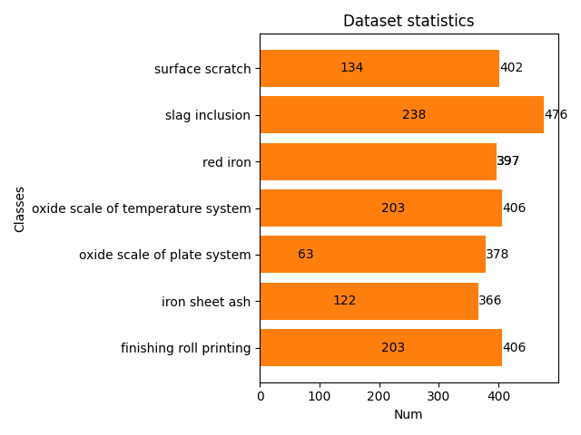

# 数据平衡和增强方法

引用自论文***Online recognition of peanut leaf diseases based on the data balance algorithm and deep transfer learning***

自建数据集—花生叶病数据集，详情如下：

| Category   | Origin photo | Cropped |
| ---------- | ------------ | ------- |
| Black spot | 17           | 138     |
| Brown spot | 166          | 266     |
| Healthy    | 190          | 536     |
| Net spot   | 4            | 159     |
| Mosaic     | 9            | 116     |
| Total      | 386          | 1215    |

**数据平衡主要步骤如下：**

- Coarse removal（粗粒清除）：原始图片中裁剪得到的部分叶片样本过于模糊，且存在多种病害并存的叶片，导致人工无法对病害进行清晰分类。手动剔除这些劣质图片。

- Retrieval（检索）：为了便于表示，将数据集进行如下表示，D={[M<sub>0</sub>, M<sub>1</sub>, M<sub>2</sub>, ..., M<sub>i</sub>], [N<sub>0</sub>, N<sub>1</sub>, M<sub>2</sub>, ..., N<sub>i</sub>]<sup>T</sup>}，其中M<sub>i</sub>代表花生叶片病害类型，N<sub>i</sub>是M<sub>i</sub>对应的样本数。最后，最大值N<sub>i</sub>被表示为N<sub>max</sub>，而对应于N<sub>max</sub>的类型M<sub>i</sub>{i∈[0, 4]}，其中i表示标签类别（label0：Black spot，label1：Brown spot，label2：Healthy，label3：Net spot，label4：Mosaic）。

- 比例系数C的计算（Calculation of the proportional constant C）：选择N<sub>max</sub>作为分子，N<sub>i</sub>作为分母，计算比例因子C<sub>i</sub>。
```math
  C_i=\frac{N_{max}}{N_i}(Countdown)
  \tag{1}
```
  
- Complex upsampling：根据不同的比例常数C进行不同的数据增强。
```math
  \begin{cases}
    0\leq C_i \leq 1, & \quad \text{Datasetunchanged}\\
    1{<} C_i {<} 3, & \quad \text{Rotation}\\
    3\leq C_i {<} 4, & \quad \text{Rotation,Contrast}\\
    4\leq C_i {<} 5, & \quad \text{Sharpness,Rotation,Contrast}
  \end{cases}
  \tag{2}
```
  
- 平衡数据：
```math
  N'=N_i \times C_i
  \tag{3}
```
  
- 最终平衡后的数据集可以表示为：
```math
  D'=\{[M_0,M_1,M_2,\cdots,M_i][N'_0,N'_1,N'_2,\cdots,N'_i]^T\}
```

- 获取到平衡后的数据集，再进行数据增强，进一步扩充数据集。

下面以该数据集为例子进行数据平衡：

假设数据集已经经过手工粗粒筛选，则N<sub>max</sub>=536，根据公式(1)可以得出以下结果：

| Category   | Number | Constant: C<sub>i</sub> |
| ---------- | ------ | ----------------------- |
| Black spot | 138    | 3                       |
| Brown spot | 266    | 2                       |
| Healthy    | 536    | 1                       |
| Net spot   | 159    | 3                       |
| Mosaic     | 116    | 4                       |

根据公式(3)，得到平衡后的结果：

| Category   | Original quantity | Add the number of samples | Quantity after data balance |
| ---------- | ----------------- | ------------------------- | --------------------------- |
| Black spot | 138               | 276                       | 414                         |
| Brown spot | 266               | 266                       | 532                         |
| Healthy    | 536               | 0                         | 536                         |
| Net spot   | 159               | 318                       | 477                         |
| Mosaic     | 116               | 348                       | 464                         |
| Total      | 1215              | 1208                      | 2423                        |

最后，再对平衡后的数据集进行整体数据增强。

## 我们的方法

- 我们认为在计算平衡因子时采用向下取整的方法过于保守，因此我们的方法中提供了两种计算方法：一是向下取整；二是四舍五入。

- 原有方法在进行数据平衡时，固定了处理图像的方法，我们方法将采用随机选取的方式，处理图像。

- 得益于albumentations数据增强库，结合我们提供的代码可以轻松实现多种方法的数据平衡与增强，同时也能很好的处理数据极端不平衡情况。

## 当前支持的数据平衡方法

- **Rotate90：** 旋转90度。
  | Origin | Rotate90 |
  | --- | --- |
  |  |  |

- **HorizontalFlip：** 水平镜像翻转。
  | Origin | HorizontalFlip |
  | --- | --- |
  |  |  |

- **Sharpen：** 随机锐化。
  | Origin | Sharpen |
  | --- | --- |
  |  |  |

- **GaussNoise：** 添加高斯噪声。
  | Origin | GaussNoise |
  | --- | --- |
  |  |  |

- **RandomSizedCrop：** 裁剪并缩放。
  | Origin | RandomSizedCrop |
  | --- | --- |
  |  |  |

- **Blur：** 模糊。
  | Origin | Blur |
  | --- | --- |
  |  |  |

## 当前支持的数据增强方法

- **CoarseDropout：** 随机遮挡。
  | Origin | CoarseDropout |
  | --- | --- |
  |  |  |

- **RandomGridShuffle：** 随机网格扰乱。
  | Origin | RandomGridShuffle |
  | --- | --- |
  |  |  |
    
- **ColorJitter：** 随机色彩扰动。
  | Origin | ColorJitter |
  | --- | --- |
  |  |  |

- **RandomShadow：** 随机添加阴影。
  | Origin | RandomShadow |
  | --- | --- |
  |  |  |

## 如何使用：

- 首先需要安装数据增强库：

  ``` 
  pip install albumentations
  ```

- 在Deal.py中设置参数：

  ``` 
  # 设置初始数据集目录
  parser.add_argument("--src_path", type=str, default=None, help="Dataset directory to be processed.")
  
  # 设置平衡因子计算方式：True-向下取整，False-四舍五入
  parser.add_argument("--conservative", type=bool, default=False, help="The balance factor is countdown or half adjust.")
  
  # 设置数据增强的强度
  parser.add_argument("--augmentation_level", type=int, default=0, help="The strength of data augmentation.")
  
  # 设置数据平衡后的保存位置，默认'./DataBlance'
  parser.add_argument("--blance_path", type=str, default='DataBlance', help="Set balanced dataset path.")
  
  # 是否进行数据增强，默认：True
  parser.add_argument("--is_augmentation", type=bool, default=True, help="Whether to augmentation dataset.")
  
  # 数据增强后的保存位置，默认'./DataAugmentation'
  parser.add_argument("--augmentation_path", type=str, default='DataAugmentation', help="Set augmented dataset path.")
  
  # 是否进行数据集划分，默认：True
  parser.add_argument("--is_partition", type=bool, default=True, help="Is the dataset partitioned.")
  
  # 设置训练集和测试集的比例，默认为9:1
  parser.add_argument("--train_test_factor", type=float, default=0.9, help="Set the ratio of train dataset to test dataset.")
  
  # 设置训练集和验证集比例，默认为4:1
  parser.add_argument("--train_val_factor", type=float, default=0.8, help="Set the ratio of train dataset set to validate dataset.")
  
  # 设置划分后数据集保存位置，默认'./DataPartition'
  parser.add_argument("--partition_path", type=str, default='DataPartition', help="Set up a directory to store divided data")
  ```

- 也可以直接使用命令：

  ``` 
  python Deal.py --src_path [dataset] --conservative False --augmentation_level 2
  ```

## 处理后的结果：

### 原始数据集：


### 数据平衡后的数据集



### 数据增强后的数据集


## 添加新的数据平衡或增强方法

需要进行两处修改：

``` 
# ImageOperate.py
# 在下面两个字典中添加方法即可，直接调用albumentations中提供的方法
self.blance_operate = {
            0: A.RandomRotate90(always_apply=True),
            1: A.HorizontalFlip(always_apply=True),
            2: A.Sharpen(always_apply=True),
            3: A.GaussNoise(var_limit=(100, 100), always_apply=True),
            4: A.RandomSizedCrop([90, 90], 128, 128, always_apply=True),
            5: A.Blur(always_apply=True)
        }
        self.augmentation_operate = {
            0: A.CoarseDropout(max_holes=8, max_width=16, max_height=16,min_holes=8,
                               min_width=8, min_height=8, fill_value=0, always_apply=True),
            1: A.RandomGridShuffle(grid=(4, 4), always_apply=True),
            2: A.ColorJitter(brightness=0.5, contrast=0.5, saturation=0.5,
                             hue=0.5, always_apply=True),
            3: A.RandomShadow(always_apply=True)
        }
```

``` 
# Deal.py
# 65行，将6修改为添加后的平衡方法数
if max(balance_factors) > 6:

# 110行，将6修改为添加后的平衡方法数
operate_index = random.sample(range(0, 6), blance_factors[index] - 1)

# 112行，将4修改为添加后的增强方法数            
if augmentation_level > 4:

# 115行，将4修改为添加后的增强方法数
operate_index = random.sample(range(0, 4), augmentation_level)
```
